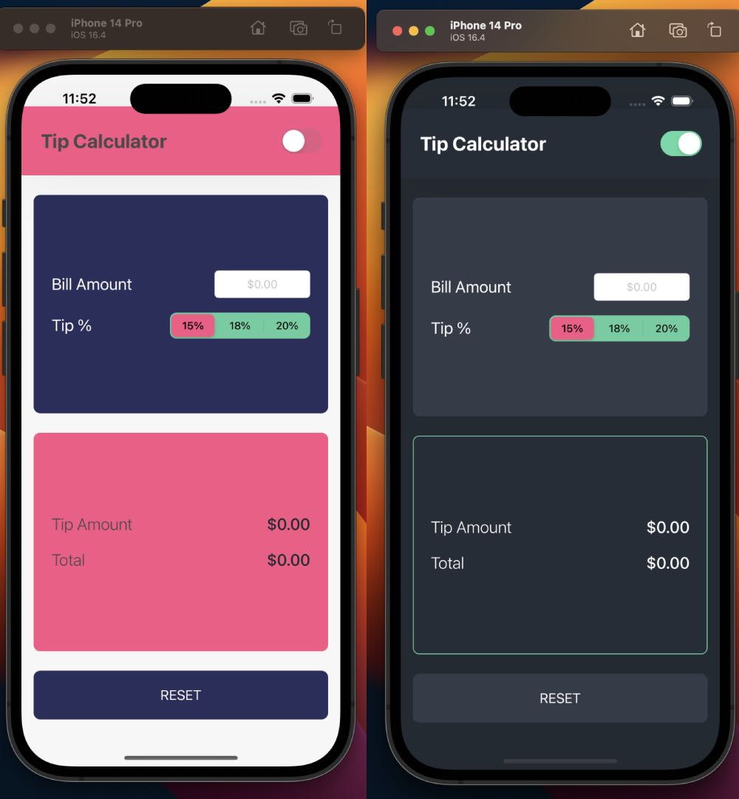

# Tip Calculator

A simple iOS app for calculating tips.

## Features

- Calculates tip based on bill amount and selected percentage.
- Allows toggling between light and dark themes.
- Uses custom text field for bill amount input that automatically formats the input as a currency.
- Displays tip amount and total bill amount after calculating tip.

## Installation

1. Clone the repository to your local machine.
2. Open `TipCalculator.xcodeproj` in Xcode.
3. Build and run the app on a simulator or device running iOS 14.0 or later.

## Usage

1. Enter the bill amount in the text field labeled "Bill Amount".
2. Select the desired tip percentage using the segmented control.
3. The tip amount and total bill amount will be calculated automatically and displayed in the output labels.
4. To switch between light and dark themes, use the switch labeled "Theme" in the top header.
